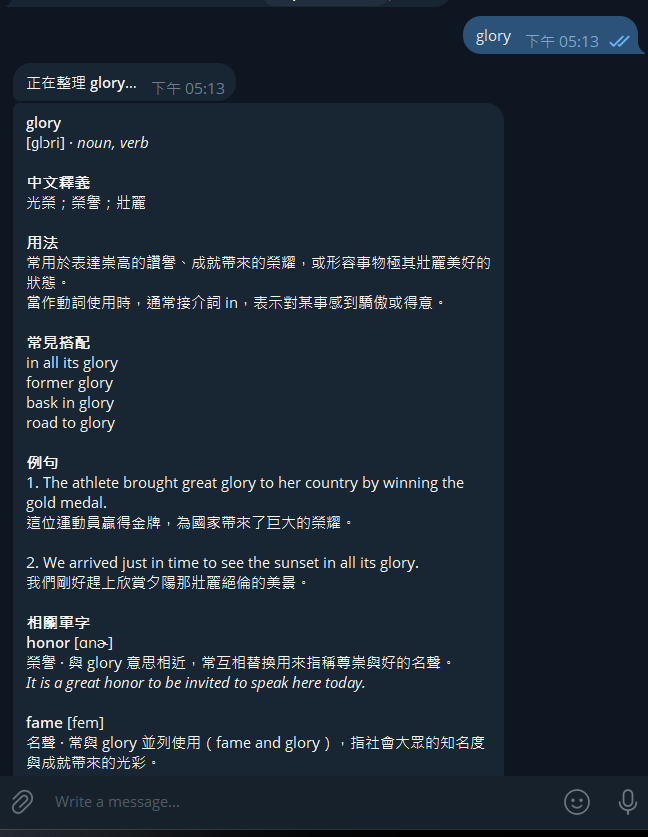
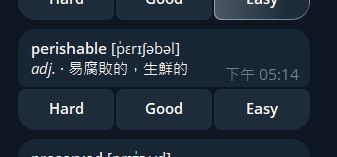

# Mnemosyne

> A self-hosted Telegram bot that turns an English word or phrase into a structured Traditional Chinese
> vocabulary card, then brings it back for recall-graded spaced repetition.

[](https://github.com/Yili-code/Mnemosyne/actions/workflows/ci.yml)
[](LICENSE)

[Quick start](#quick-start) · [How to use it](#how-to-use-it) ·
[Architecture](#architecture) · [Configuration](#configuration) ·
[Deployment](DEPLOYMENT.md) · [Contributing](CONTRIBUTING.md)

Mnemosyne is an alpha-stage, owner-only vocabulary workflow for Traditional Chinese speakers. Send
an English word or multi-word term in a private Telegram chat; Gemini returns a schema-validated card containing
KK phonetics, meanings, usage notes, collocations, examples, and related vocabulary. The bot stores
the words and later asks you to grade your recall with **Hard**, **Good**, or **Easy**.

It is designed for:

- learners who want a private English vocabulary workflow inside Telegram;
- developers studying a small AI-backed webhook service with durable retries and scheduled work.

It is **not** a public hosted bot, a multi-user platform, or a complete dictionary. You provide and
operate the Telegram, Gemini, and Google Cloud credentials for your own instance.

## What it does

- Validates Gemini's structured JSON with Pydantic before saving it.
- Filters obvious inflections and routine derivatives from related vocabulary.
- Stores data in SQLite for local development or Firestore for Cloud Run.
- Retries failed Gemini generations from durable storage after 15 minutes, 1 hour, 6 hours, then
  once per day.
- Selects only due words for review; showing a card does not count as a successful review.
- Uses Cloud Tasks to rate-limit and retry production review delivery.
- Rejects non-owner chats, duplicate Telegram updates, and unauthenticated task requests.

## Product flow

1. Send one English word or phrase, for example `glory` or `canonical record`.
2. Receive a generated and validated learning card.
3. Use `/review` or wait for the daily job, then grade your recall.
4. Mnemosyne schedules the word's next due time from that grade.

<p align="center">
  
</p>

<p align="center">
  
</p>

These screenshots come from the deployed owner-only instance and contain no credentials, account
name, chat ID, or unrelated conversation history.

## Quick start

This path proves that the package installs and the FastAPI process starts locally. It does **not**
connect Telegram to your computer; Telegram requires a public HTTPS webhook. Use the
[deployment guide](DEPLOYMENT.md) for an operational bot.

### Requirements

- Python 3.11 or newer
- Git
- PowerShell (commands below target Windows)

### 1. Install

```powershell
git clone https://github.com/Yili-code/Mnemosyne.git
cd Mnemosyne
python -m venv .venv
.\.venv\Scripts\python.exe -m pip install -e ".[dev]"
Copy-Item .env.example .env
```

The placeholder `.env` is enough for the health check. Replace its values with real credentials
before invoking Telegram, Gemini, Firestore, or protected task endpoints.

### 2. Start the application

```powershell
.\.venv\Scripts\python.exe -m uvicorn vocab_bot.app:app --host 127.0.0.1 --port 8000 --reload
```

### 3. Verify the first successful run

Open a second PowerShell window:

```powershell
Invoke-RestMethod http://127.0.0.1:8000/health
```

Expected result:

```text
status
------
ok
```

The `/health` endpoint proves only that the process is reachable. It does not verify the Telegram
webhook, Gemini generation, persistence, Cloud Tasks, or scheduled delivery.

## How to use it

After completing [DEPLOYMENT.md](DEPLOYMENT.md), open the configured bot's private chat and use:

| Input | Behavior |
| --- | --- |
| `meticulous` or `canonical record` | Generate, validate, save, and return one vocabulary card |
| `/ask What's the difference between assignment and homework?` | Ask a question through Gemini without saving it as vocabulary |
| `/search canonical record` | Read one exact saved term without writing data or calling Gemini |
| `/review` | Send due words for recall grading |
| `/words` | List saved words, parts of speech, and Chinese meanings |
| `/clear` | Ask for confirmation, then delete learning and retry data |
| `/help` | Show the in-bot instructions |

One English word or multi-word term is accepted per message. Extra whitespace is normalized;
hyphenated or apostrophized words are valid, while numbers and other punctuation are rejected. The
bot responds only in the configured owner's private chat.

If a release changes inline buttons, run the webhook setup again so Telegram continues to deliver
`callback_query` updates:

```powershell
.\.venv\Scripts\python.exe scripts\setup_webhook.py
```

## Architecture

```text
Telegram message
    │  X-Telegram-Bot-Api-Secret-Token
    ▼
FastAPI / Cloud Run ──► VocabularyService ──► Gemini API
                               │                    │
                               │ validated card     │ retryable failure
                               ▼                    ▼
                        SQLite / Firestore ◄── pending_words
                               │                    ▲
                               │ due words          │ Cloud Scheduler
                               ▼
                         Cloud Tasks ──► Telegram review cards
                                            │
                                            └─ Hard / Good / Easy callback
```

### Core flows

**Word generation**

1. `POST /telegram/webhook` verifies Telegram's secret header.
2. `VocabularyService.handle_update()` enforces the owner-only and duplicate-update boundaries.
3. `GeminiClient.create_card()` requests JSON matching `VocabularyCard`.
4. Pydantic validates the response; deterministic rules remove predictable word-family noise.
5. The selected repository saves the input term and related vocabulary, then Telegram renders the card.

**Review delivery**

1. `/review` or `POST /tasks/daily-review` selects words whose `due_at` has passed.
2. Local mode sends directly; production mode enqueues one Cloud Task per card.
3. A Telegram callback atomically grades the word and updates its next due time.

The scheduler is deliberately SM-2-inspired, not an FSRS implementation. A word's first visible
interval is 1 day for Hard, 3 days for Good, or 7 days for Easy; later intervals use the stored ease
factor and are capped at 365 days.

**Failure recovery**

1. A Gemini timeout, provider error, or invalid response creates a `pending_words` record.
2. `POST /tasks/retry-failed` claims at most one due item using a short lease.
3. Success saves and returns the card; failure advances the capped retry schedule.

### HTTP endpoints

| Endpoint | Caller | Protection | Purpose |
| --- | --- | --- | --- |
| `GET /health` | operator / platform | none | Process health only |
| `POST /telegram/webhook` | Telegram | webhook secret header | Messages and callbacks |
| `POST /tasks/daily-review` | Cloud Scheduler | `X-Cron-Secret` | Daily due-word selection |
| `POST /tasks/retry-failed` | Cloud Scheduler | `X-Cron-Secret` | Process one failed generation |
| `POST /tasks/send-review-card` | Cloud Tasks | `X-Cron-Secret` | Deliver one queued review card |

## Project structure

```text
.
├── src/vocab_bot/
│   ├── app.py                # FastAPI endpoints and dependency wiring
│   ├── config.py             # Environment parsing and validation
│   ├── service.py            # Commands, workflows, retries, and review orchestration
│   ├── models.py             # Pydantic generation and persistence contracts
│   ├── gemini.py             # Structured generation and provider error boundary
│   ├── repository.py         # Repository protocol, SQLite, and Firestore
│   ├── review_tasks.py       # Cloud Tasks enqueueing and task deduplication
│   ├── spaced_repetition.py  # Due selection and deterministic interval updates
│   ├── telegram.py           # Telegram API client and HTML rendering
│   └── word_rules.py         # Input normalization and derivative filtering
├── scripts/setup_webhook.py  # Register Telegram message and callback updates
├── tests/                    # Offline unit and service-level tests
├── docs/assets/              # Sanitized Telegram screenshots
├── DEPLOYMENT.md             # Google Cloud setup and live verification
├── CONTRIBUTING.md           # Scope, checks, and pull-request expectations
├── SECURITY.md               # Credential and vulnerability guidance
├── Dockerfile                # Cloud Run container entrypoint
└── pyproject.toml            # Package metadata, dependencies, pytest, and Ruff
```

## Configuration

Copy `.env.example` to `.env`. The populated file is ignored by Git; never place real values in
commits, screenshots, logs, issues, or test fixtures.

| Variable | Required when | Default / accepted value |
| --- | --- | --- |
| `TELEGRAM_BOT_TOKEN` | any bot workflow | no usable default |
| `TELEGRAM_OWNER_CHAT_ID` | any bot workflow | numeric private-chat ID |
| `TELEGRAM_WEBHOOK_SECRET` | webhook requests and setup script | no usable default |
| `GEMINI_API_KEY` | any bot workflow | no usable default |
| `GEMINI_MODEL` | Gemini generation | `gemini-3.5-flash-lite` |
| `CRON_SECRET` | any bot workflow | protects all `/tasks/*` endpoints |
| `STORAGE_BACKEND` | application workflow | `sqlite`; accepts `sqlite` or `firestore` |
| `SQLITE_PATH` | SQLite mode | `data/vocabulary.sqlite3` |
| `GOOGLE_CLOUD_PROJECT` | Firestore deployment; required by `cloud_tasks` mode | Google Cloud project ID |
| `REVIEW_DELIVERY_MODE` | review delivery | `direct`; accepts `direct` or `cloud_tasks` |
| `CLOUD_RUN_SERVICE_URL` | webhook setup or `cloud_tasks` mode | deployed HTTPS base URL |
| `CLOUD_TASKS_QUEUE` | `cloud_tasks` mode | `mnemosyne-review` |
| `CLOUD_TASKS_LOCATION` | `cloud_tasks` mode | `asia-east1` |
| `REVIEW_SIZE` | review selection | `20`; integer from 1 to 50 |
| `TIMEZONE` | daily delivery date | `Asia/Taipei`; valid IANA timezone |

`Settings.from_env()` loads the whole runtime configuration lazily on the first non-health request.
That is why `/health` can succeed while a bot request still fails because a credential is missing.

## Development and verification

Run the same offline checks expected by CI:

```powershell
.\.venv\Scripts\python.exe -m pytest --basetemp=.pytest-tmp
.\.venv\Scripts\python.exe -m ruff check .
.\.venv\Scripts\python.exe -m ruff format --check .
git diff --check
```

The test suite covers input rules, Pydantic payloads, Telegram rendering, SQLite persistence,
retry backoff, update and delivery deduplication, review scheduling, and service orchestration. Tests
mock external services; passing them does not prove that live credentials, IAM, webhook delivery, or
Google Cloud resources are configured correctly.

For a behavior change, verify the narrowest relevant layer first:

1. pure rules and models;
2. service flow with fakes;
3. SQLite repository behavior;
4. local FastAPI boundary;
5. controlled live Telegram, Gemini, Firestore, Cloud Tasks, and Scheduler checks when applicable.

## Deployment

Production uses Cloud Run, Firestore, Secret Manager, Cloud Tasks, Cloud Scheduler, and a Telegram
webhook. Follow [DEPLOYMENT.md](DEPLOYMENT.md) instead of treating the local quick start as a deploy
procedure. Its [production checklist](DEPLOYMENT.md#9-production-checklist) separates process health
from end-to-end delivery evidence.

Important production constraints:

- Cloud Run's filesystem is ephemeral; use `STORAGE_BACKEND=firestore`.
- There is no built-in SQLite-to-Firestore migration command.
- Store credentials in Secret Manager and grant the runtime service account only required roles.
- Register both `message` and `callback_query` webhook updates.
- A successful Scheduler request alone does not prove that Telegram received a review card.

## Guidance for AI coding agents

Before editing behavior, read files in this order:

1. `src/vocab_bot/app.py` for entrypoints and dependency selection;
2. `src/vocab_bot/service.py` for user-visible workflows;
3. `src/vocab_bot/models.py` and `repository.py` for durable contracts;
4. the focused module and its corresponding `tests/test_*.py` file;
5. `CONTRIBUTING.md` and `DEPLOYMENT.md` when scope or operations change.

Preserve these invariants unless the task explicitly changes them:

- one configured owner and one private Telegram chat;
- credentials and complete provider responses never enter logs or fixtures;
- `VocabularyCard` is validated before persistence;
- SQLite and Firestore implement the same `Repository` contract;
- repeated Telegram updates and review callbacks are idempotent, and repeated enqueue attempts use
  deterministic Cloud Task names; final Telegram delivery remains at-least-once;
- review delivery does not increment `review_count`; only a valid due-word grade does;
- production scheduled work is durable in Firestore or Cloud Tasks, not an in-process timer;
- unit tests stay offline and deterministic;
- `/clear` requires explicit confirmation and deletes learning data, not update-deduplication records.

When reporting verification, distinguish offline tests, local HTTP checks, and live external-service
checks. Evidence from one boundary must not be presented as proof of another.

## Known limitations and troubleshooting

- **Alpha compatibility:** version `0.1.0` does not promise a stable internal API or data schema.
- **Single-user access:** multi-user accounts, teams, and a public demo are outside the current model.
- **Generated content:** schema and deterministic filters are tested; semantic correctness still
  depends on the configured Gemini model.
- **Delivery semantics:** Cloud Tasks is at-least-once. A rare ambiguous Telegram network result can
  produce a duplicate card because Telegram does not accept an idempotency key.
- **Storage portability:** local SQLite data is not automatically copied into Firestore.

Common diagnostic boundaries:

| Symptom | Check first |
| --- | --- |
| `/health` works but the bot is silent | Telegram webhook URL/status, secret header, then Cloud Run logs |
| First bot request reports a missing variable | Compare `.env` with `.env.example`; `/health` does not load full settings |
| Firestore returns permission denied | Runtime service account and `roles/datastore.user` |
| Words disappear after a Cloud Run redeploy | Confirm production uses `STORAGE_BACKEND=firestore` |
| Scheduler says success but no review arrives | Due words, `daily_deliveries`, Cloud Tasks, then Telegram delivery |

See [DEPLOYMENT.md](DEPLOYMENT.md) for the complete operational checklist and failure boundaries.

## Contributing and project direction

The current direction is reliability within the narrow owner-only workflow: clearer setup,
reproducible bug fixes, data integrity, secure operations, and focused learning usability. Propose
multi-user support, new infrastructure providers, or other scope expansions in an issue before
implementation.

Read [CONTRIBUTING.md](CONTRIBUTING.md) before opening a pull request. Security vulnerabilities
should follow [SECURITY.md](SECURITY.md), not a public issue. Released changes are recorded in
[CHANGELOG.md](CHANGELOG.md).

## License

Mnemosyne is released under the [MIT License](LICENSE).
